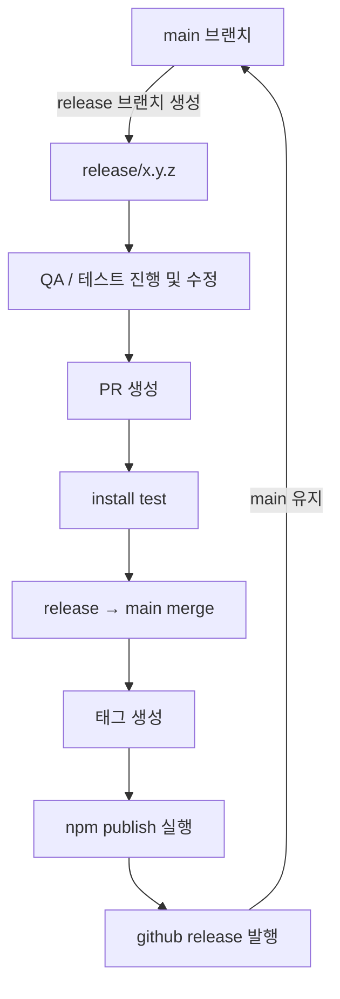

# npm 패키지 발행 전략

## CI/CD 프로세스 (GitHub Actions 기반)

### 1. 통합 릴리스 워크플로우

- 회의나 스레드로 논의하여 배포 시점을 확정하고, 해당 배포 범위에 맞게 release/x.y.z 형태로 브랜치를 분기합니다.
- 분기한 브랜치에서 담당자는 QA 작업을 진행하며 다음을 점검합니다.
  - 잘못된 코드가 포함되지 않았는지
  - 기능이 정상 동작하는지
- release → main PR이 생성되면 GitHub Action이 자동으로 install 테스트를 실행합니다.
- release → main으로 merge되면, GitHub Action이 자동으로 실행되어 브랜치명에서 버전을 추출하고 태그를 생성합니다.
- 새로 생성된 태그를 트리거로 npm publish가 수행됩니다.
- publish가 성공하면, GitHub Action이 GitHub Release를 자동 발행합니다.
- 담당자는 GitHub Release 페이지에서 **릴리스 노트(변경사항, 주의사항 등)**를 확인 및 수정합니다.

### 2. 버전 관리 정책

#### 2.1 major, minor, patch 선택 기준

- `major`: **Breaking Changes** 발생시
  - API 변경, 호환성 깨짐
  - 예: `1.0.0` → `2.0.0`
- `minor`: **새로운 기능** 추가시
  - 하위 호환성 유지
  - 예: `1.0.0` → `1.1.0`
- `patch`: **버그 수정** 및 **보안 패치**
  - 기존 기능 개선
  - 예: `1.0.0` → `1.0.1`

#### 2.2 Deprecated 관리

- **오래된 버전 Deprecated 정책**:
  - 3개월 전 사전 공지
  - 마이그레이션 가이드 제공

### 3. Publish 전략 비교

| 전략                     | 설명                                                | 자동화 정도 | 추천 |
| ------------------------ | --------------------------------------------------- | ----------- | ---- |
| **수동 태그**            | 로컬에서 직접 태그 생성 및 푸시                     | 하          | ❌   |
| **버전 스크립트**        | npm version 명령어로 버전 증가 및 태그 생성         | 하          | ❌   |
| **Manual Github Action** | GitHub UI에서 버전 입력하여 태그 생성               | 중          | ✅   |
| **PR Github action**     | PR merge 시 자동으로 태그 생성(release 브랜치 사용) | 상          | ✅   |

- 개발자의 배포부담을 줄이고 안정성을 위하여 PR Github action 전략을 채택합니다.

### 4. 배포 기준

#### 4.1 배포 주기

- **비정기 배포**: 회의나 스레드로 논의하여 배포 시점을 확정하고 배포 범위에 맞게 release 브랜치 분기하여 배포
- **긴급 배포**: 보안 패치나 치명적 버그 수정 시 즉시 배포

#### 4.2 배포 조건

1. **기능 완성도**

   - 모든 기능이 완전히 구현되어야 함
   - 모든 테스트 통과

2. **코드 품질**

   - ESLint 오류 0개
   - TypeScript 컴파일 오류 0개
   - 코드 리뷰 승인 2명 이상

3. **문서화**
   - story 사용법 예제 작성 (새 기능의 경우)

### 5. 롤백 전략

#### 5.1 롤백 기준

- **즉시 롤백**: 치명적 버그, 보안 취약점 발견 시
- **검토 후 롤백**: 기능 동작 불안정, 성능 저하 시

#### 5.2 롤백 프로세스

1. **문제 발견 및 보고**

   - Discode thread 생성하여 공유
   - 심각도 평가 (High, Medium, Low)

2. **롤백 결정**

   - High: 즉시 롤백
   - Medium: 팀 논의 후 24시간 내 결정
   - Low: 다음 정기 배포에서 수정

3. **롤백 실행**

   - GitHub Actions에서 수동 롤백 워크플로우 실행

---

## 티켓

#### Mid Priority

1. Github 설정 및 태그 생성 (1h)

   - NPM_TOKEN 시크릿 설정
   - 배포된 버전에 맞춰서 0.0.3 tag 생성
   - PAT 토큰 생성 및 설정

2. publish 환경설정 (5h)

   - `package.json`: `exports`를 통해 개별 컴포넌트 import 지원, `files`를 통해 npm에 업로드할 파일 지정
   - `tsconfig.build.json`: 배포용 TypeScript 설정 분리
   - `vite.config.ts`: React를 번들에 포함하지 않게 하고 ES 모듈 설정 등 수정
   - `src/index.ts`: 메인 진입점 생성

3. 태그 생성 워크플로우 구현 (3h)

   - `release/x.y.z` 형태의 브랜치가 merge될 경우 동작
   - 브랜치명에서 버전을 추출하여 `npm version x.y.z` 명령어로 버전 설정
   - 주의: PAT 토큰으로 태그를 생성해야 배포 워크플로우가 동작 (GITHUB_TOKEN은 github 정책으로 workflow 트리거를 하지 못함)

4. 배포 워크플로우 (3h)

   - 태그 생성시 배포

5. npm install test 워크플로우(5h)
   - release -> main PR이 생성되었을때 npm pack 을 사용하여 install 가능 여부 테스트

#### Low Priority

6. 롤백 워크플로우 구현 (3h)

   - manual로 구현, input으로 `tag`와 `deprecated 사유`를 받음
   - npm 배포된 패키지는 삭제 불가능하므로 deprecated만 가능

7. GitHub Release 생성 워크플로우 (3h)

   - GitHub Release를 생성하여 GitHub 우측 메뉴에 표시
